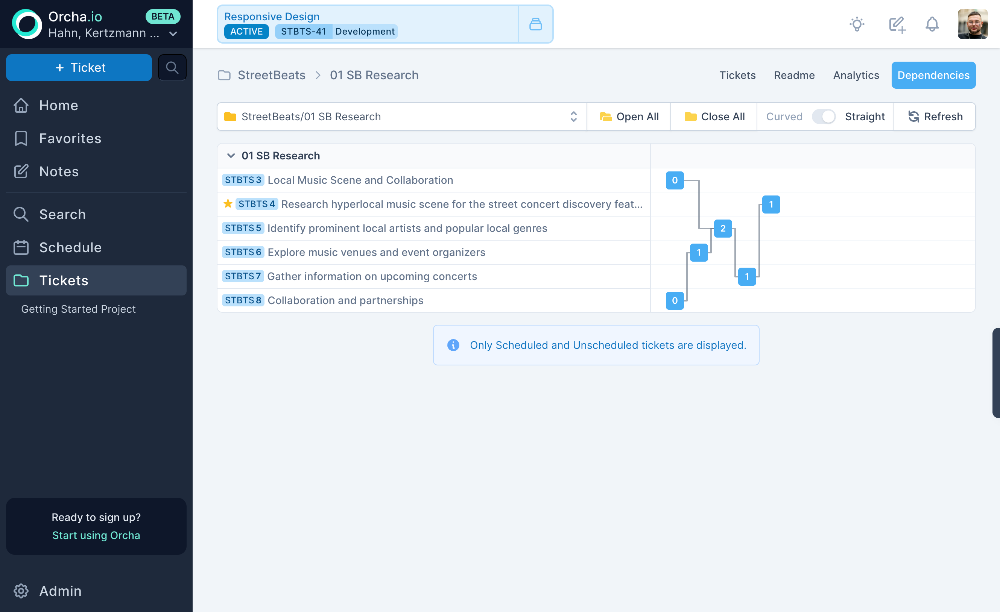

:::tip[The principle]
Dependencies are vital for accurate predictions. If they're friction to set, people skip them, and your schedule is wrong.
:::

Dependencies aren't a nice-to-have, they're a core input to the scheduler. The scheduler uses them to ensure tickets are executed in the right order, model cross-timezone handoff delays, and produce delivery dates that reflect how work actually flows. Without them, the scheduler is guessing at sequencing.

That's why Orcha makes dependencies trivial to create. If linking two tickets takes five clicks and a modal dialog, no one will bother. Then your scheduler operates on incomplete information and produces dates that don't reflect reality.

Orcha makes dependencies trivial to create. Link tickets directly from the ticket detail view or from the project dependency graph. The interface is designed so that setting a dependency takes less effort than deciding not to.

## Two kinds of dependency

Orcha handles both **cross-ticket** and **intra-ticket** dependencies.

- **Cross-ticket**: Ticket A blocks Ticket B. The classic "finish the API before building the frontend" relationship.
- **Intra-ticket**: Step sequences within a single ticket, dev, then code review, then QA. These are ordered stages that the scheduler treats as sequential sub-tasks.

Both types feed into the same scheduling engine. You don't manage them differently; they just exist at different levels of granularity.

## How the scheduler uses them

The scheduler treats dependencies as hard constraints. A blocked ticket will never be scheduled before its blocker is complete, no manual Gantt-chart dragging required. If ticket B depends on ticket A, and ticket A is assigned to someone in a different time zone, the scheduler factors in the handoff gap, ticket B won't start until ticket A is done and the receiving engineer's work day begins.

When multiple tasks become available at the same time, the scheduler picks the highest-priority one first. Dependencies constrain what is available; priorities decide what runs next. This means adding or removing a single dependency can shift ETAs across your entire project, because it changes the set of tasks the scheduler is allowed to explore at each step.

This means your schedule reflects reality: sequential work stays sequential, parallel work runs in parallel, and cross-timezone handoffs don't produce impossible timelines. The scheduler respects all of this automatically, you set the relationships, it does the math.

> **How Orcha resolves dependencies under the hood.** Most scheduling systems flatten a [directed acyclic graph](https://en.wikipedia.org/wiki/Directed_acyclic_graph) into a linear order using [topological sorting](https://en.wikipedia.org/wiki/Topological_sorting) and then walk that list. Orcha does not. Instead, each task tracks an `ancestors` list (the UIDs of every task it depends on) and a live `pending_ancestor_count`. When a task completes, every successor has its count decremented. A task becomes available to schedule only when its count hits zero. This ancestor-tracking approach means the scheduler never needs a full re-sort, it reacts to completions incrementally, which keeps simulation fast even on large [dependency graphs](https://en.wikipedia.org/wiki/Dependency_graph).

## Visual dependency graph

Each project includes a visual graph of its ticket dependencies. See the full picture of what blocks what, identify bottlenecks, and spot circular dependencies before the scheduler does. The graph updates automatically as you add or remove links.
