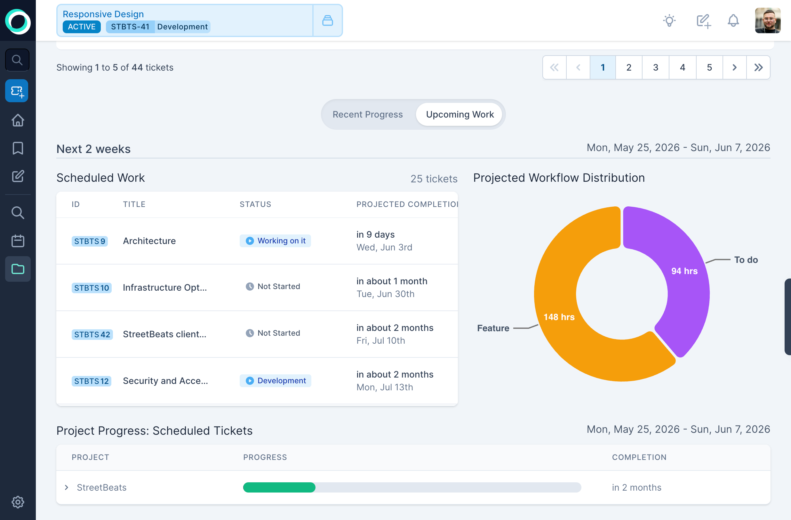

This page walks through what you'll see when you first log in to Orcha, so you know where everything lives before diving in.

## The Task Switcher

At the top of every page sits the Task Switcher bar. It shows your currently active task and your next recommended task. Click to switch, Orcha handles time tracking automatically. No timesheets, no manual logging. Just work on what's in front of you.

## The Dashboard

Your dashboard is the home screen. It's designed to answer one question: _what should I do right now?_

It's split into sections:

- **Tickets to estimate**, Tickets assigned to you that still need estimates. Orcha can't schedule what it can't size, so these surface first.
- **Checklist**, Your personal to-do list for the day.
- **Tickets worked on**, What you've touched recently, so you can pick up where you left off.
- **Prepare for what's next**, Upcoming tickets the scheduler thinks you should start looking at.
- **Unscheduled tickets**, Tickets that exist but aren't scheduled yet, usually because they're missing estimates or assignments.

## Sidebar navigation

The left sidebar gives you access to the main areas:

- **Home**, The dashboard above.
- **Favorites**, Quick access to starred projects and tickets.
- **Notes**, A personal scratchpad with the same rich text editor used in tickets.
- **Search**, Full-text search across tickets, projects, and notes.
- **Schedule**, The schedule views (more on those below).
- **Tickets**, A flat list of all tickets across projects.
- **Admin**, Team settings, work weeks, roles, and organization config.

## Schedule views

The schedule is where the scheduler's output becomes visual. There are several ways to look at the same underlying data:

**Calendar**, A week-by-week view of who's working on what, including time-offs.

**Swimlanes**, One lane per engineer. Drag tickets between lanes to reassign work, and the schedule recalculates.

**Gantt**, A timeline view showing ticket durations, dependencies, and overlap.

## Tickets and projects

Tickets are where the work lives. Each ticket has a rich text description, comments, workflow state, and dependencies. Each workflow step gets its own assignee and three-point estimate (best/likely/worst).

Projects are folders. They can nest, have their own readme, and show analytics for the work inside them.

## Dependencies

Dependencies are visual and easy to set. Select a ticket, pick what it depends on, and the scheduler respects the ordering automatically.

## Editing the schedule

You can fine-tune schedule parameters, priorities, assignments, work weeks, from the schedule editor. Autopilot re-runs the simulation on every change.

From here, explore the rest of the docs to go deeper on any of these areas.
