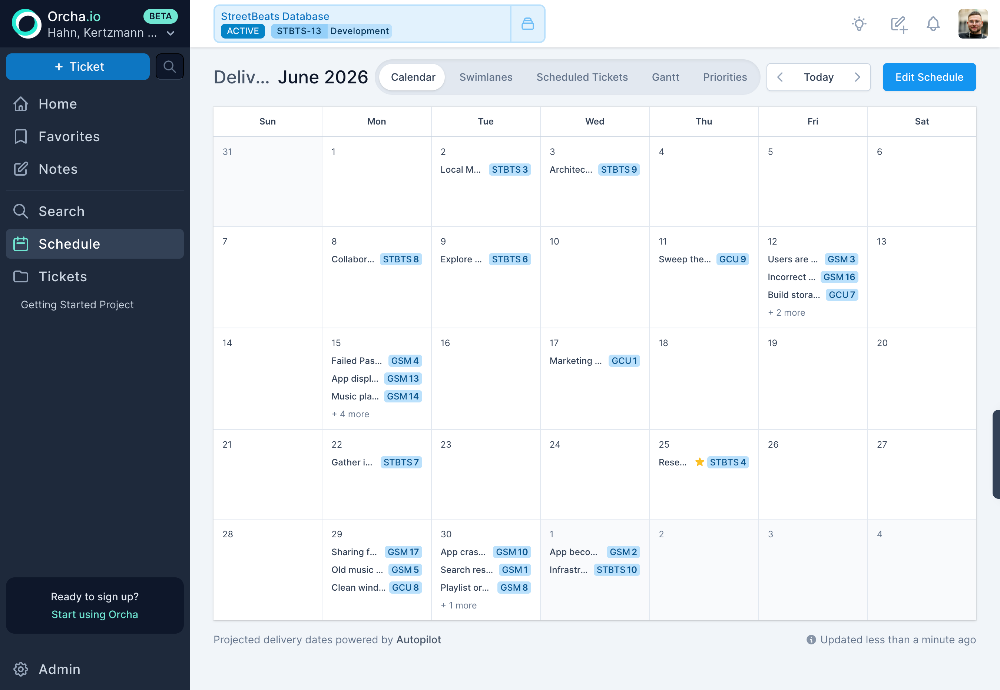
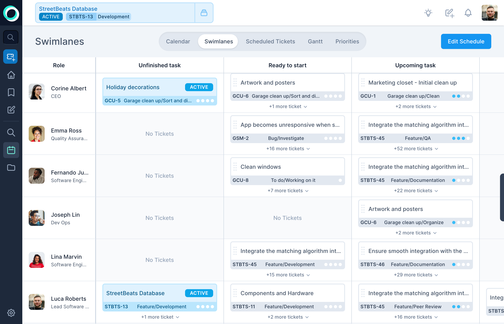
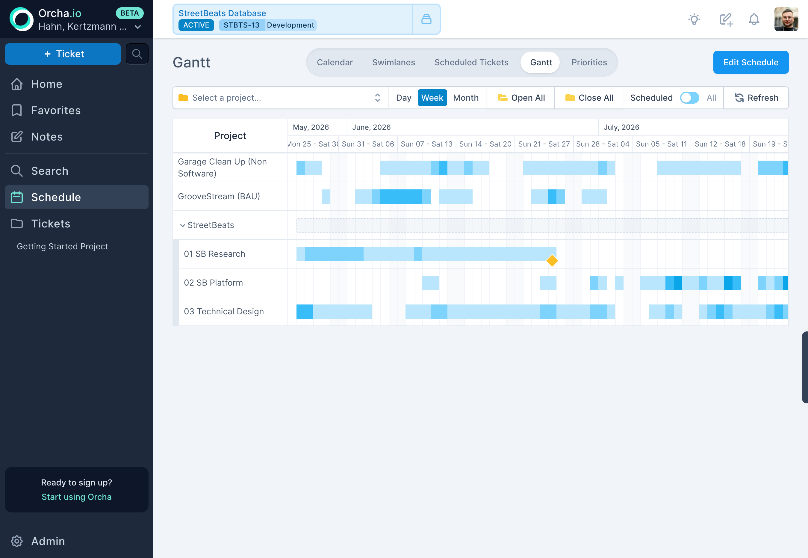
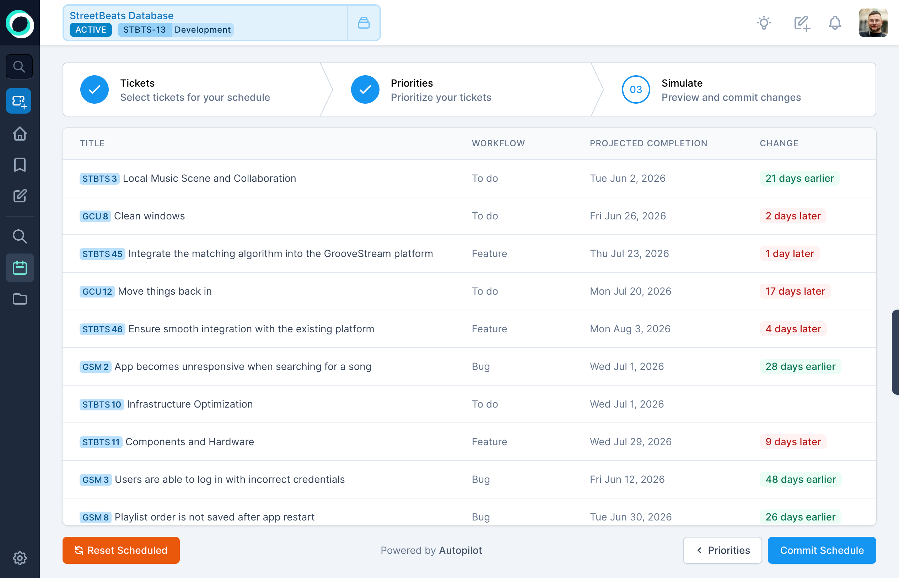

:::tip[The principle]
Same data, different lens. Five views derived from one simulation, always consistent with each other.
:::

A schedule is only useful if you can see it from the angle that answers your current question. "When does this ship?" is a different question from "What should this person work on next?" or "How does the project timeline look at the quarterly level?" Same data, different lens.

Orcha gives you five views of the schedule, all derived from the same [Monte Carlo simulation](/docs/scheduling/) output. They're always consistent with each other because they're reading the same source of truth.

> **Consistency guarantee.** Calendar, swimlanes, Gantt, ticket list, and priorities are not independent datasets. They are projections of a single simulation result. Change a priority or reassign a ticket, re-simulate, and every view updates together. There is no drift between them because there is nothing to drift -- they share one underlying model.

## Calendar

A monthly delivery calendar showing which tickets land on which dates. This is where you go when someone asks "when does feature X ship?", find the ticket, see the date. No mental math, no cross-referencing sprint boundaries.

## Swimlanes

Per-engineer lanes showing four columns: unfinished work in progress, ready to start, upcoming, and awaiting estimate. This is a command center, not a status board. You can see at a glance who's overloaded, who's about to run out of work, and where estimates are missing.

Drag a ticket from one person's lane to another to reassign it. The scheduler picks up the change on the next run and recomputes downstream dates.

## Gantt

A project-level timeline with day, week, and month zoom levels. Milestones mark key delivery dates. This is the view for stakeholder conversations, it shows the shape of the project over time without getting into individual ticket details.

Unlike a traditional Gantt chart, you're not manually dragging bars around. The positions come from the scheduler. When priorities change, the bars move on their own.

## Scheduled tickets

A flat list of every scheduled ticket, sortable and filterable. When you need to find a specific ticket's scheduled date or check which tickets are assigned to a specific person, this is the fastest path. No visual overhead, just a table with the data you need.

## Priorities

View and reorder the priority stack. Drag tickets up or down to change their relative priority. The scheduler uses this ordering as its primary input, higher priority tickets get scheduled first, and everything downstream adjusts. This is where you make trade-offs explicit instead of leaving them implicit in someone's head.

## Edit Schedule

When you need to make deliberate changes to the schedule, the Edit Schedule wizard walks you through three steps:

1. **Select tickets**, Choose which tickets to include in the next simulation. Add new ones, remove ones that are on hold, adjust the scope.
2. **Set priorities**, Reorder the selected tickets by priority. This is the input that matters most to the scheduler.
3. **Simulate and commit**, Run the simulation and review the results before committing. See the projected dates, check for conflicts, and only commit when you're satisfied.

This three-step process exists because schedule changes have consequences. Bumping one ticket up pushes others down. The wizard makes those trade-offs visible before they become real, so you're making informed decisions instead of optimistic ones.
