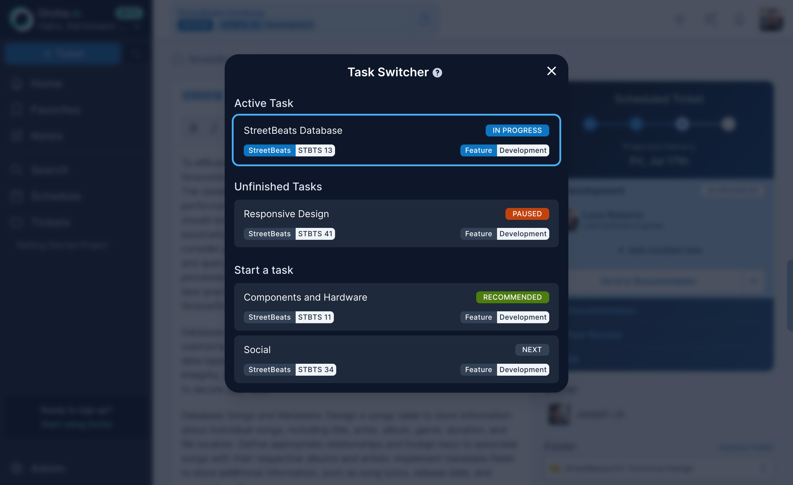

:::tip[The principle]
Don't track time, just switch tasks. The system learns from what you do, not what you report.
:::

You shouldn't need to open a board, find a ticket, click "start timer," fill out a form, and then start working. That's ceremony, not productivity.

The Task Switcher sits at the top of your screen at all times. It shows two things: the task you're currently working on, and the next task the scheduler recommends based on priorities and dependencies.

## How it works

When you're ready to move on, click the next task. That's it. Your active task switches, time tracking updates automatically, and the dashboard reflects the change. No forms, no start/stop buttons, no end-of-day timesheet.

The recommended task comes from the scheduler. It factors in priority order, dependency chains, and what's actually ready for you to pick up. You can always override it -- just search for any ticket and activate it instead -- but the recommendation is right more often than not.

> **Not a simple sort.** The "recommended next task" is not just the highest-priority ticket in your backlog. It comes from the scheduler's full scheduling pass, which accounts for [dependency resolution](https://en.wikipedia.org/wiki/Topological_sorting), team capacity, time-offs, and work already in progress. The recommendation reflects what you should start next given the current state of the entire project, not just your personal queue.

## Why this matters

Time tracking fails when it depends on human discipline. People forget. People round up. People fill in yesterday's timesheet from memory on Friday afternoon. The Task Switcher removes the friction entirely. You're already switching tasks in your head, now your tool knows about it too.

The data feeds back into the scheduling model, adjusting velocity estimates based on how work actually flows rather than how people say it flows.
