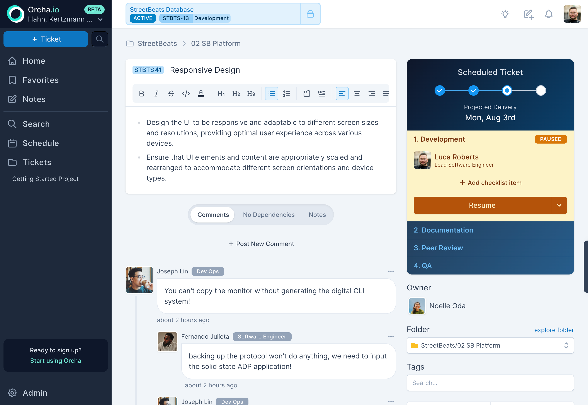

:::tip[The principle]
If we ask for information, it'll be worth 10x the time you spent giving it. Three estimates, transition notes, every input feeds the scheduler.
:::

A ticket is the smallest unit of work Orcha schedules. Everything else, projects, schedules, dependencies, analytics, derives from tickets. Get tickets right and the rest follows.

## Ticket lifecycle

Every ticket follows the same lifecycle, regardless of project or workflow:

1. **Draft**, a ticket that exists but isn't ready. Use it for rough ideas, placeholders, or work that needs more detail before it can be estimated.
2. **Unscheduled**, once you publish a draft, it becomes unscheduled. This is where you assign it to someone and send it to be estimated.
3. **Scheduled**, once a ticket has estimates and has been included in a simulation, it gets a delivery date. The workflow steps (Development, QA, etc.) kick in here.
4. **Done / Cancelled**, the ticket is completed or dropped.

The workflow you define per project, Development, Code Review, QA, or whatever stages make sense, only activates after scheduling. Before that, the ticket is moving through the lifecycle above.

:::note[Estimates are locked after scheduling]
Once a ticket is scheduled, its estimates can't be changed. This feels unusual, but it's intentional. Estimates should be made with consistent context every time, that's how the statistical model improves. If people revise estimates after seeing reality, you introduce bias and the model never converges. It takes roughly 20 tickets for the math to kick in and predictions to sharpen.
:::

## Creating and editing

Tickets use a rich-text editor built on TipTap. Bold, headings, code blocks, lists, images, embedded Excalidraw sketches, whatever it takes to communicate the work clearly. The editor is collaborative in real-time: multiple people can edit the same ticket description simultaneously, and changes merge automatically via CRDT.

This matters because the gap between "what was asked" and "what was understood" is where most engineering waste lives. The richer the medium, the smaller the gap.

## Three estimates per workflow step

Every workflow step takes three time estimates in hours: best case, most likely, and worst case. These three points aren't just a range, they define the shape of uncertainty. A step estimated at 4/8/16 hours has a tight, symmetric spread. A step at 4/8/80 hours has a long, dangerous tail. The three numbers capture that difference where a single estimate never could.

A single estimate is a commitment disguised as a prediction. Three estimates are honest about uncertainty.

> **Under the hood: PERT distributions.** The three estimates are converted to a [PERT distribution](https://en.wikipedia.org/wiki/PERT_distribution), a special case of the [beta distribution](https://en.wikipedia.org/wiki/Beta_distribution), with a weighting factor (lambda) of 4.0. The deterministic fallback uses the [PERT expected value](https://en.wikipedia.org/wiki/Three-point_estimation): `(best + 4 * likely + worst) / 6`. This weights the "most likely" value four times more than the extremes, which is a better central tendency than a naive average when distributions are skewed.

The scheduler samples from this distribution across thousands of simulations. The result is an 80% confidence delivery date, a number grounded in probability, not optimism.

## Workflow transitions with notes

Tickets move through a linear workflow, a sequence of stages you define per project. Every transition requires a note explaining why the ticket moved. This is non-negotiable by design.

Each workflow state, Development, Code Review, QA, or whatever stages you define, gets its own three-point estimate. A ticket that takes one week to build might take two days in review and another week in QA. These are different kinds of work with different uncertainty profiles, so Orcha tracks them separately. The ticket's total ETA is the maximum p80 across all workflow states, because a chain is only as fast as its slowest link.

> **Why per-state estimates matter.** Collapsing all workflow states into a single estimate hides where time actually goes. Per-state estimates let the scheduler model each phase independently, and they give you the data to spot systemic bottlenecks, like a code review step that routinely blows past its worst case.

When a ticket goes from QA back to dev, you always know why. When something sits in review for three days, the note trail tells the story. Transitions without context are how teams lose information. Orcha makes context the default.

## The right panel

The ticket detail view shows critical metadata in a right panel: the scheduled delivery date from the latest simulation, the current workflow step, the ticket owner, the parent folder, and assigned tags. Everything you need at a glance without scrolling.

## Comments

A threaded comments section below the description for discussion, questions, and decisions. Comments are separate from the description by design, the description is the source of truth for what the work is, comments are the conversation around it.

## Dependencies and tags

Link tickets as dependencies directly from the detail view. Tag tickets for cross-cutting concerns that don't map to folder structure, "tech-debt," "design-review," "customer-reported." Tags are searchable and filterable across the entire workspace.
